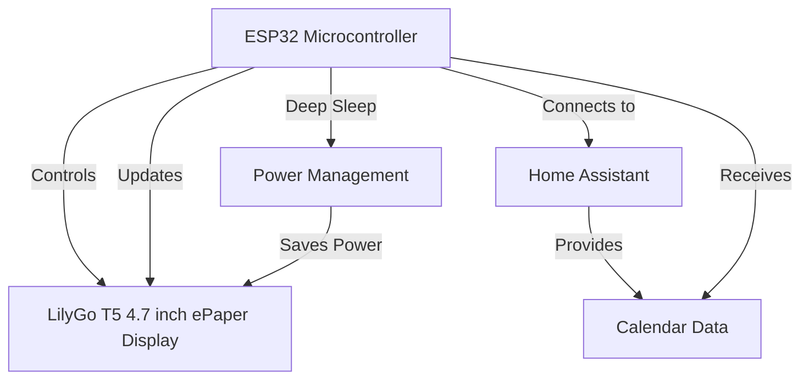
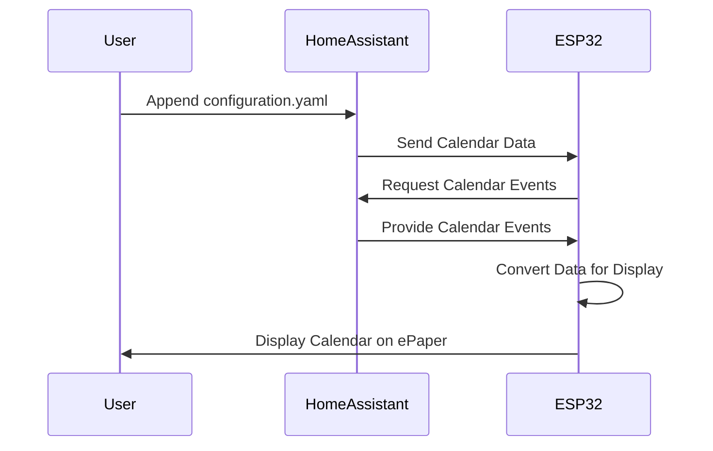
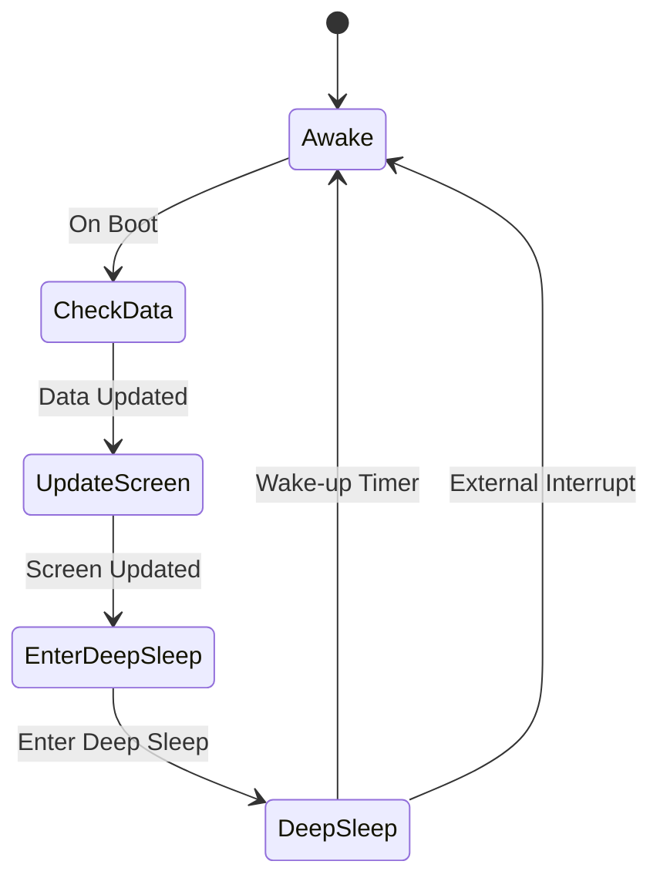

# ESPHome LilyGo T5 4.7 inch ePaper Calendar Display

This project allows you to create an ePaper calendar display using ESPHome and Home Assistant. It displays your calendar events from Home Assistant on an ePaper display, providing an elegant way to view your upcoming schedule.

Based on and inspired by the excellent work from:

https://github.com/paviro/ESPHome-ePaper-Calendar/

But instead I am using a LilyGo T5 4.7" ePaper display. This is a 4.7" e-paper display module with a resolution of 960x540 pixels in black and white. The display is based on the IT8951 controller and uses the ESP32 microcontroller. The board includes:

- 4.7 inch e-paper display (960x540 resolution)
- ESP32-S3 microcontroller
- USB-C connector for power and programming
- MicroSD card slot
- Battery connector
- Reset and boot buttons
- Expansion headers

The display provides excellent readability with a wide viewing angle and crisp text display, making it perfect for a calendar application. Since it's an e-paper display, it only consumes power when updating the screen, making it very energy efficient.

## System Architecture

### 1. System Architecture Diagram

This diagram shows the main components of the system and how they interact with each other.



### 2. Home Assistant Integration Flow

This diagram illustrates the steps required to integrate the ePaper calendar with Home Assistant.



### 3. Deep Sleep and Wake-up Process

This diagram shows the deep sleep and wake-up process of the ESP32.



## Integrating with Home Assistant

To make your ePaper calendar work properly, you need to add some sensors to Home Assistant by following these additional steps:

### 1. Configuration Sensors and Integrations:

- Append the contents of `configuration.yaml` from this project to your Home Assistant `configuration.yaml` file without overwriting existing configurations you have made.
- If sections like `template:` or `input_boolean:` already exist, append the new configurations below them without duplicating section names.

### 2. Entity IDs Update:

- Update the entity IDs (`calendar.x`, `calendar.y` ...) in `configuration.yaml` to match those of your Home Assistant calendars.

### 3. Script Setup:

- Copy the `python_scripts` folder into your Home Assistant configuration directory. If a `python_scripts` folder already exists, transfer the `esp_calendar_data_conversion.py` file into it.

### 4. Calendar Name Adjustments:

- If using multi-word calendar names, add these to the `CALENDAR_NAMES` list in `esp_calendar_data_conversion.py`, for example:
  ```python
  CALENDAR_NAMES = {"calendar.family_events": "Family Events", "calendar.work_events": "Work Events"}
  ```

### 5. Home Assistant Restart:

- Restart Home Assistant to apply the changes.

### 6. Adding your device to Home Assistant:

- After the firmware is compiled and uploaded, and the Inkplate board is powered, add it to Home Assistant for data synchronization. It should be detected under `Settings -> Devices`.

sequenceDiagram
participant User
participant HomeAssistant
participant ESP32

    User->>HomeAssistant: Append configuration.yaml
    HomeAssistant->>ESP32: Send Calendar Data
    ESP32->>HomeAssistant: Request Calendar Events
    HomeAssistant->>ESP32: Provide Calendar Events
    ESP32->>ESP32: Convert Data for Display
    ESP32->>User: Display Calendar on ePaper
